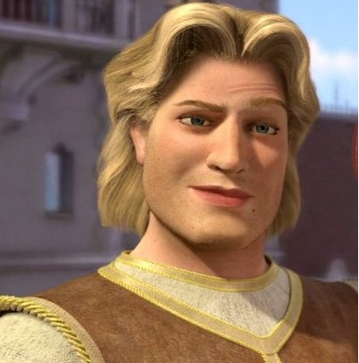

# 🗡 Льова

| Стать   | Вік      | Зріст  | Вага   | Раса   | Рід зайнятості | Родом з |
| ------- | -------- | ------ | ------ | ------ | -------------- | ------- |
| Чоловік | 28 років | 192 см | 102 кг | Людина | Вельможа, воїн | Полтава |

Льова де Пукіш — дворянин, нащадок давнього та багатого роду Пукішів, син барона Едварда де Пукіша, спадкоємець земель Малоросії. Любить бенкети, гулянки та полювання. В погоні за різного роду пригодами з метою завоювати пошану батька.

#### Ціль

Батько Льови барон Едвард де Пукіш не хоче передавати синові свої землі, які по праву повинні будуть йому належати. Бажаючи довести батькові, що він заслуговує на це, Льова одягається в обладунки і вирушає в дорогу.

#### Характер

Владний, рішучий та мудрий. Льова має добре розвинений аналітичний розум, який дозволяє йому приймати правильні рішення і вести за собою групу.

#### Стати

| 🛡 Броня | ❤️ Здоров'я |
| ------- | ----------- |
| 16      | 20          |

| Сила | Спритність | Витривалість | Мудрість | Інтелект | Харизма |
| ---- | ---------- | ------------ | -------- | -------- | ------- |
| +3   | +1         | +2           | 0        | -1       | +2      |

#### Інвентар

- <b>Довгий меч</b>, атака +5, шкода 1D8+3, з двох рук - 1D10+3;
- Кольчужна сорочка;
- Порожній гаманець;
- <b>Щит</b>. +2 до броні під час використання;
- Мотузка з кішкою;
- Смолоскипи.

#### Здібності та магія

- <b>Друге дихання</b> (1 раз на день). Віднови 1D10+2 здоров'я моментально;
- <b>Швидка дія</b> (1 раз на день). Ти можеш зробити 2 дії (атаки) у свій хід.
