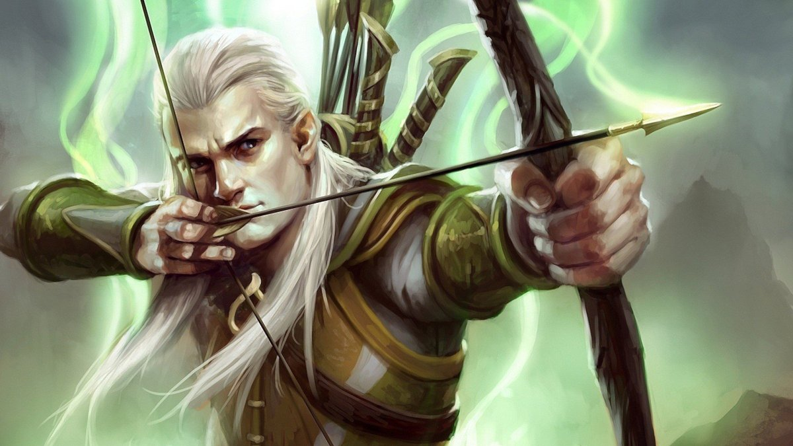

# Тупик

| Стать   | Вік     | Зріст  | Вага  | Раса | Рід зайнятості   | Родом з          |
| ------- | ------- | ------ | ----- | ---- | ---------------- | ---------------- |
| Чоловік | 33 роки | 181 см | 75 кг | Ельф | Рейнджер, лучник | Івано-Франківськ |

Ельф Тупик - самотній мандрівник без сім'ї та близьких, проте знайшов собі друга Льову з яким познайомились у лісі на полюванні (Льова врятував Тупика від дикого скаженого кабана).

#### Ціль

Тупик ніколи не знав дружби раніше і тепер готовий на все, щоб віддати борг Льові.

#### Характер

Тупик.

#### Стати

| 🛡 Броня | ❤️ Здоров'я |
| ------- | ----------- |
| 14      | 14          |

| Сила | Спритність | Витривалість | Мудрість | Інтелект | Харизма |
| ---- | ---------- | ------------ | -------- | -------- | ------- |
| +1   | +3         | 0            | +3       | +1       | -1      |

#### Інвентар

- <b>Лук</b>, атака +5, шкода 1D6+3;
- <b>Ельфійський меч</b>, атака +3, шкода 1D6+3;
- Шкіряний обладунок;
- Дресирована щуриня Людмила;
- Щурячий корм;
- Сагайдак зі стрілами та 20 стріл у ньому.

#### Здібності та магія

- <b>Подвійний постріл із лука</b> (2 рази на день). Ти можеш вистрілити двома стрілами за один раз;
- <b>Розмова з тваринами</b> (3 рази на день). Ти можеш розмовляти з тваринами після цього заклинання;
- <b>Тварина компаньйон</b> (3 рази на день). У тебе є дрібна тварина - щур Людмила, яка виконує будь-які твої команди, але не говорить і не спілкується без застосування магії чи природних особливостей інших персонажів.
